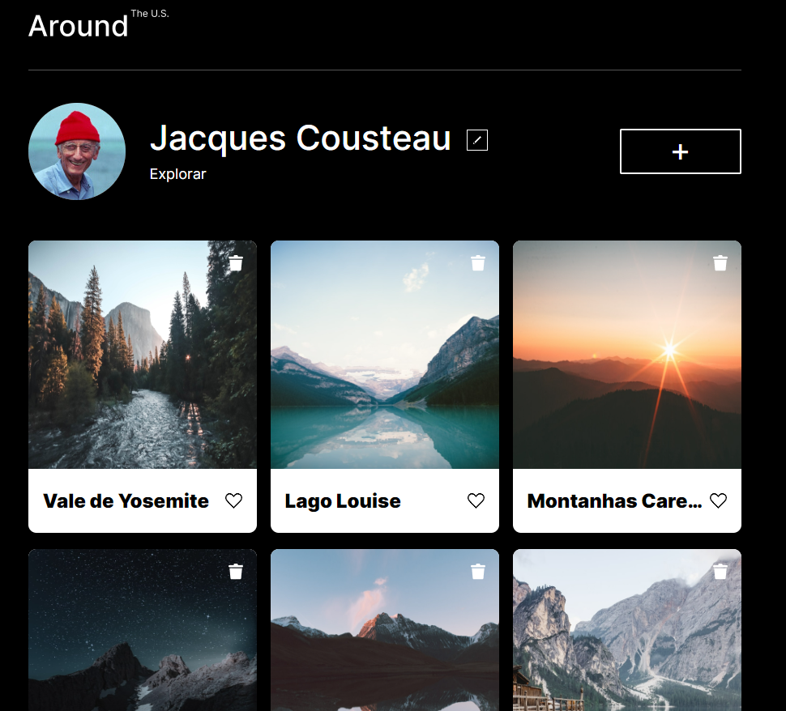
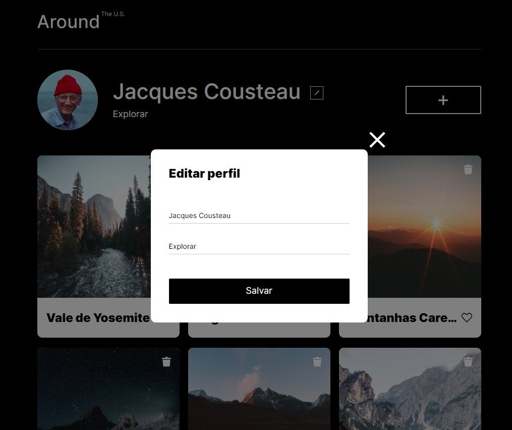

# Projeto 4:  EUA Afora

## Visão geral

Este projeto é uma página protótipo de uma rede social onde os usuários podem compartilhar seus hobbies, nome de usuário, cards sobre suas histórias e editar essas informações. O projeto utiliza HTML, CSS e JS, e ao longo do desenvolvimento irá evoluir com o uso de pacotes e plugins gerenciados pelo NPM.

## Recursos

### Pacotes

#### Webpack

O Webpack é uma ferramenta de empacotamento de módulos JavaScript e outros ativos relacionados (como CSS, imagens e fontes), facilitando a criação de pacotes otimizados para implantação em ambientes de produção.

#### Babel

O Babel é uma ferramenta que converte código JavaScript escrito em sintaxe moderna (como ES6+) para uma versão compatível com navegadores mais antigos ou ambientes que não suportam as últimas funcionalidades do JavaScript.

#### PostCSS

O PostCSS é uma ferramenta que processa e transforma código CSS por meio de plugins, permitindo realizar tarefas como minificação, prefixação automática e outras otimizações.

## Figma

* [Link para o projeto no Figma](https://www.figma.com/file/XfB6BSINvliub43JgKza1e/WEB.-Sprint-4.-Around-The-U.S.-desktop-%2B-mobile-pt)

## Capturas de tela

## Licença

Este projeto está sob a licença [ISC](https://pt.wikipedia.org/wiki/Licen%C3%A7a_ISC).

## Deployment

[Deploy do projeto aqui!](https://dlaranjeirasilva.github.io/web_project_4_ptbr/)
